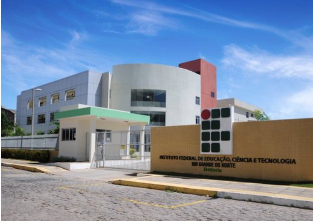
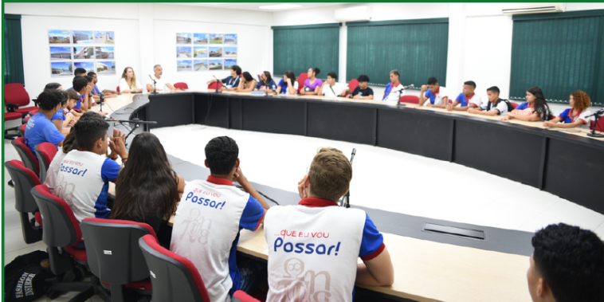

# Relatório de visita

## Informações gerais
- **Disciplina**: Sistemas Operacionais (SO) do curso de TADS (Superior em Tecnologia em Análise e Desenvolvimento de Sistemas) no CNAT-IFRN (Instituto Federal de Educação, Ciência e Tecnologia do Rio Grande do Norte - Campus Natal-Central).
- **professor**: [Leonardo A. Minora](https://github.com/leonardo-minora)
- **Local da visita técnica**: DIRETORIA-GERAL DE TECNOLOGIA DA INFORMAÇÃO (DGTI) – REITORIA IFRN

- **Aluno**: [Jesrriel Moura lopes]

## 1. Introdução

### 1.1 O IFRN

O Instituto Federal de Educação, Ciência e Tecnologia do Rio Grande do Norte (IFRN) é uma instituição de ensino que atua na oferta de cursos técnicos, de graduação e pós-graduação. Sua missão é promover ensino, pesquisa e extensão, formando profissionais capacitados para o mercado de trabalho e contribuindo para o desenvolvimento da sociedade.

### 1.2 O que é a DGTI?

A Diretoria-Geral de Tecnologia da Informação (DGTI) é o setor responsável por coordenar e gerenciar os serviços de tecnologia da informação dentro do IFRN. Suas atribuições incluem a administração da infraestrutura de rede, suporte técnico, segurança digital e desenvolvimento de sistemas, garantindo que as ferramentas tecnológicas utilizadas pela comunidade acadêmica funcionem de maneira eficiente.

### 1.3 Objetivo da Visita

A visita teve como principal objetivo compreender o funcionamento da DGTI e sua importância para a gestão do IFRN. Durante a visita, foi apresentado o Sistema Unificado de Administração Pública (SUAP), explicando sua criação, evolução e impacto na administração dos Institutos Federais. Além disso, foi possível observar a organização dos setores e os principais desafios enfrentados pela equipe de tecnologia.

## 2. Descrevendo a visita

A visita foi realizada na Sala de Atos da Reitoria do IFRN, onde recebemos uma apresentação sobre a estrutura da DGTI e suas áreas de atuação. Durante essa exposição, foi mencionado que um egresso do curso de TADS atualmente ocupa o cargo de diretor de TI do IFRN, evidenciando a relevância da formação na instituição.

Posteriormente, realizamos um tour pelas dependências da DGTI, conhecendo os principais setores responsáveis pelo funcionamento tecnológico da instituição:

Sala dos Desenvolvedores de Software: Atualmente, a equipe de desenvolvimento trabalha em modelo remoto, refletindo a tendência de digitalização e flexibilidade no setor de TI.
Sala dos DevOps: O setor de DevOps opera de forma semi-remota, sendo responsável pela infraestrutura de servidores, automação e segurança dos sistemas institucionais.
Sala do Diretor: Visitamos o espaço onde são tomadas decisões estratégicas sobre a gestão da tecnologia da informação no IFRN.
Durante a visita, foi destacado que a DGTI se baseia em três pilares principais, garantindo um funcionamento estruturado e eficiente. Além disso, foi ressaltado que essa diretoria possui a mesma relevância da Diretoria de Ensino, pois seu papel é essencial para a operacionalização dos sistemas acadêmicos e administrativos do IFRN.

## 3. Considerações finais

A visita técnica à DGTI da Reitoria do IFRN permitiu uma visão aprofundada sobre a importância da gestão de TI dentro da instituição. Observamos como a tecnologia impacta diretamente a administração acadêmica e administrativa, garantindo eficiência e inovação nos processos institucionais.

Além disso, a evolução do SUAP, sistema desenvolvido dentro do próprio IFRN e hoje adotado por diversos Institutos Federais do país, demonstra o potencial da tecnologia aplicada à gestão pública.

Outro ponto relevante foi a constatação de que ex-alunos do curso de TADS ocupam cargos estratégicos dentro da DGTI, evidenciando as oportunidades que a área de TI oferece e a importância da formação acadêmica para o desenvolvimento profissional.

Por fim, a experiência reforçou a percepção de que a tecnologia não é apenas um suporte, mas um pilar essencial para o funcionamento da instituição, sendo fundamental para o ensino, a pesquisa e a gestão educacional.

